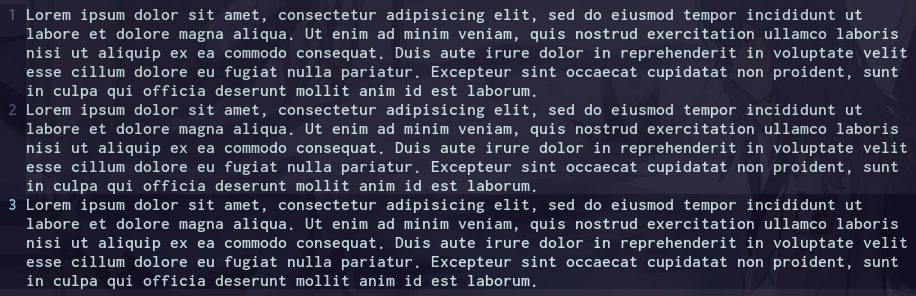
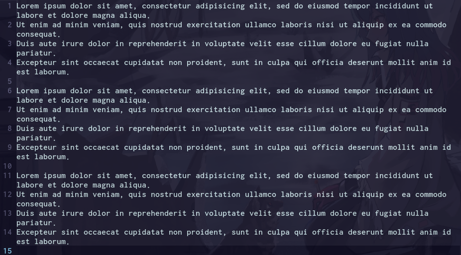

# sharpjoin

## Showcase

Let's say you have 3 paragraphs. They are pretty hard to edit in vim as they are single lines.

How about pressing 1 key to split them to multiple lines by sentences? Don't worry. it's reversible.

## Intro

A pretty simple program that splits each paragraph (line) of given text by sentences and adds a blank line after.  
Of course, after that it can join all sequences of lines without blank lines into single strings (paragraphs) for pasting back in e.g. LibreOffice after editing in Vim.

[text.vim](text.vim) 
is for using as a custom formatter for 
[NeoFormat](https://github.com/sbdchd/neoformat).
Assumes you have sharpjoin in PATH

## TODO:
- [ ] ReadAllLines => StreamReader as it could be faster
- [ ] Ignore some abbreviations e.g. e.g. after which the capitalized word will be on a new line
- [x] Fix adding a whitespace after a paragraph
